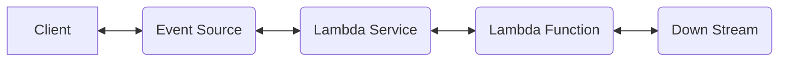
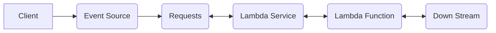
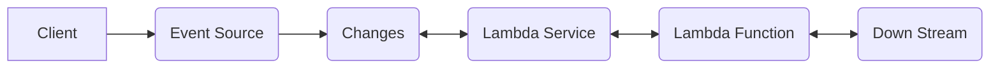

# Lambda layers of defense

> DRAFT: Work in progress

You are responsible for maintaining control over your content that is hosted on this infrastructure.

## Event Sources

### Synch flow (API GW, AppSync)

- Event source can authorize requests (cognito or oidc or jwt or custom or ssl client auth)
- Event source can be linked to a waf (AWS Shield, AWS WAF) or cdn (CloudFront)
- Event source can add usage limits and throttling per api client per endpoint
- Event source can include request validation
- Event source can be within a [VPC](https://docs.aws.amazon.com/apigateway/latest/developerguide/apigateway-private-apis.html)
- Event source can limit sourceIp or VPC [Controlling access to an API with API Gateway resource policies](https://docs.aws.amazon.com/apigateway/latest/developerguide/apigateway-resource-policies.html)

### Asynch flow (S3, EventBridge)

- Event source can do batching
- Event source can have filtering

### Asynch flow (Dynamodb)

- Updates can be filtered
- Updates can be sent to EventBridge to further filtering

## Ideas to be documented

- [Data protection in AWS Lambda](https://docs.aws.amazon.com/lambda/latest/dg/security-dataprotection.html){target="_blank"}
    - `Encryption in transit` - Lambda API endpoints only support secure connections over HTTPS.
    - `Encryption at rest` - On a per-function basis, you can configure Lambda to use a [customer managed key to encrypt your environment variables](https://docs.aws.amazon.com/lambda/latest/dg/configuration-envvars.html#configuration-envvars-encryption){target="_blank"}. Conterary to the AWS docs, i would not recommended using environments variables for secrets, but rather secret manager (or parameter store).
    Lambda always encrypts files that you upload to Lambda, including deployment packages and layer archives. Amazon CloudWatch Logs and AWS X-Ray also encrypt data by default.
- "Identity and access management for Lambda" - least priviledge
    - [Identity and access management for Lambda](https://docs.aws.amazon.com/lambda/latest/dg/security-iam.html)
- "Compliance validation for AWS Lambda"
    - SOC1, SOC2, SOC3, PCI, FedRAMP, HIPAA, ISMAP etc..
    - [AWS Services in Scope by Compliance Program](https://aws.amazon.com/compliance/services-in-scope/)
    - [AWS Artifact](https://aws.amazon.com/artifact/)
- "Resilience in AWS Lambda"
- "Managed runtimes"
- "Limiting concurrency" / "Throttling"
    - [Creating and using usage plans with API keys](https://docs.aws.amazon.com/apigateway/latest/developerguide/api-gateway-api-usage-plans.html)
    - [Lambda function scaling](https://docs.aws.amazon.com/lambda/latest/dg/invocation-scaling.html)
- "Authentication"
    - JWT, Cognito etc..
- "Input / Output validation"
    - Docs [Enable request validation in API Gateway](https://docs.aws.amazon.com/apigateway/latest/developerguide/api-gateway-method-request-validation.html)
    - Example [API Gateway data validation](https://serverlessland.com/patterns/apigw-data-validation)
    - Using framework code like Pydantic or JMESchema
- "VPC"
    - [Configuring a Lambda function to access resources in a VPC](https://docs.aws.amazon.com/lambda/latest/dg/configuration-vpc.html)
- "Observability" (Logging, Metrics, Tracing)
- "Event sourcing" - Locking down the event source
- Patching library dependencies
    - [Snyk – Commercial Vulnerability DB and Dependency Check](https://snyk.io/)
- Static code analysis (code complexity, code style, code quality, security, etc ...)
- Lambda versioning
- Idempotency (best practices)
- Code Signing
    - [Code Signing, a Trust and Integrity Control for AWS Lambda](https://aws.amazon.com/blogs/aws/new-code-signing-a-trust-and-integrity-control-for-aws-lambda/)
- Secrets management
    - No hard coding of secrets and use SST where possible
    - [Monitor AWS Secrets Manager secrets](https://docs.aws.amazon.com/secretsmanager/latest/userguide/monitoring.html)
    - [Deploy Serverless Applications with AWS Lambda and API Gateway](https://learn.hashicorp.com/tutorials/terraform/lambda-api-gateway)
- Limit function to single use case, keep code simple and small
- Validate input / output via Jmepath / Pydantic

## Resources

- [Security Overview of AWS Lambda](https://docs.aws.amazon.com/whitepapers/latest/security-overview-aws-lambda/security-overview-aws-lambda.pdf){target="_blank"}
- [Security pillar](https://docs.aws.amazon.com/wellarchitected/latest/serverless-applications-lens/security-pillar.html)
- [aws-serverless-security-workshop](https://github.com/aws-samples/aws-serverless-security-workshop)
- [Input Validation Cheat Sheet](https://cheatsheetseries.owasp.org/cheatsheets/Input_Validation_Cheat_Sheet.html)
- [lumigo - AWS Lambda Security](https://lumigo.io/aws-lambda-deployment/aws-lambda-security/)
